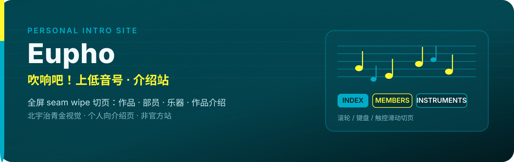
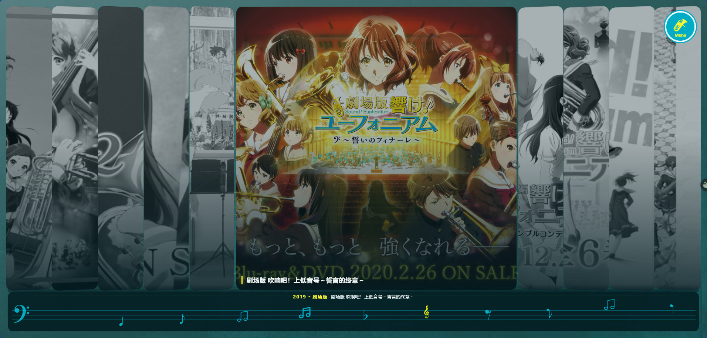
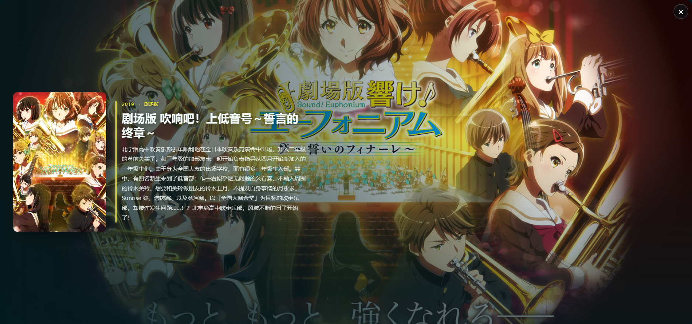
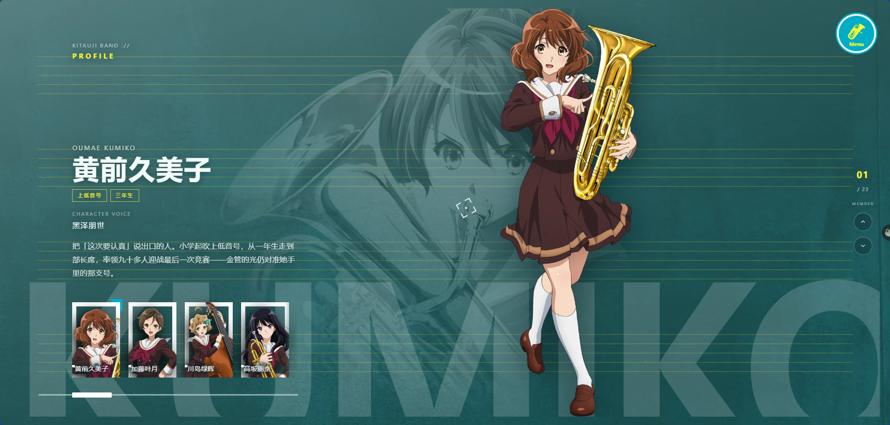
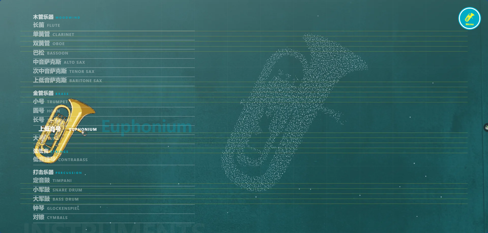
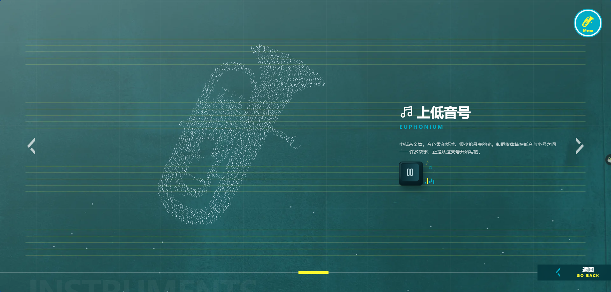
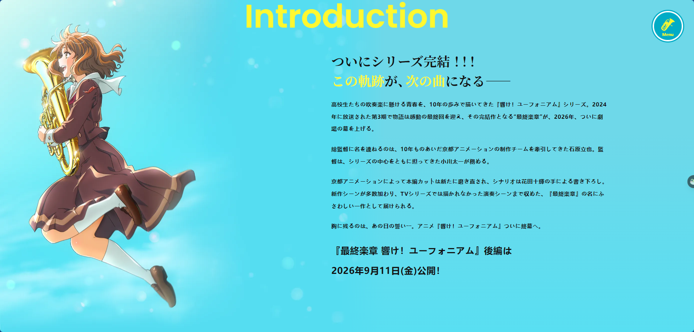
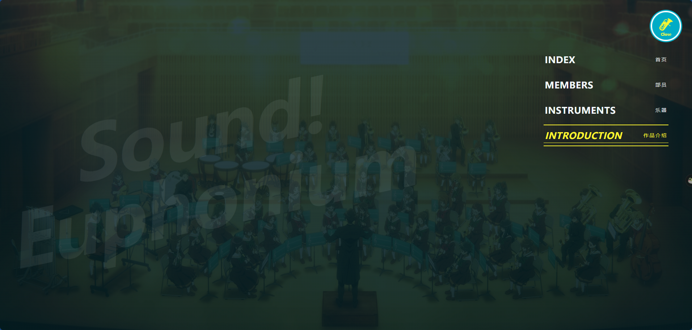
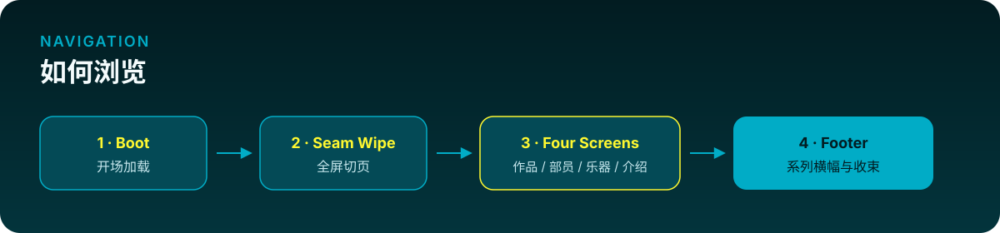

<p align="center">
  
</p>

<p align="center">
  <strong>北宇治高校吹奏乐部</strong> 的个人向介绍页<br>
  用全屏 seam wipe 把《吹响吧！上低音号》的作品、部员与乐器讲清楚<br>
  <em>非官方 · 非宣发 · 个人项目</em>
</p>

<p align="center">
  <a href="#预览"></a>
  <a href="#本地运行"></a>
  <a href="#本地运行"></a>
</p>

---

## 预览

<p align="center">
  
</p>

### INDEX · 作品

手风琴式系列封面，底部谱线导航；点开可看系列详情。

<p align="center">
  
</p>

<p align="center">
  
</p>

### MEMBERS · 部员

立绘、声部、年级与简介；侧栏可切换部员。

<p align="center">
  
</p>

### INSTRUMENTS · 乐器

按声部分类浏览；粒子成型展示乐器形态，可进详情试听。

<p align="center">
  
</p>

<p align="center">
  
</p>

### INTRODUCTION · 作品介绍

双语介绍文与最终乐章信息；支持屏内滚动。

<p align="center">
  
</p>

### 菜单与页脚

全局菜单可跳转任一屏；末页继续滑出页脚与系列横幅。

<p align="center">
  
</p>

<p align="center">
  
</p>

---

## 这是什么

面向观众的系列介绍站，不是通用落地页模板。

| 内容 | 说明 |
| --- | --- |
| **作品** | TV 三季、剧场版、特别篇、最终乐章等，用封面 / 主视觉介绍 |
| **角色** | 部员立绘、声部、年级与简介 |
| **乐器** | 部中出现的乐器，含粒子展示与试听 |

交互是全屏 **seam wipe** 切页：桌面滚轮 / 键盘、手机滑动均可。

> 本站是个人介绍页，不冒充京都动画或官方宣发。

---

## 如何浏览

<p align="center">
  
</p>

1. 开场加载后进入首页 INDEX  
2. 滚轮、方向键或触控滑动切换四屏  
3. 右上角 Menu 可直接跳转  
4. 最后一屏继续下滑进入页脚

---

## 本地运行

```bash
npm install
npm run dev
```

其他脚本：

```bash
npm run build    # 类型检查 + 生产构建
npm run preview  # 预览构建结果
npm run lint     # Oxlint
```

---

## 技术栈

| 层 | 选型 |
| --- | --- |
| UI | React 19 · TypeScript |
| 构建 | Vite 8 |
| 路由 | TanStack Router |
| 样式 | Tailwind CSS 4（北宇治主题色） |
| 动效 / 滚动 | GSAP · Lenis · 自定义 seam wipe |

主题色：主色 `#01acc6` · 辅色 `#fff830` · 深底 `ink` / `deep` / `panel`。黄只做点缀，不整页铺黄。

---

## 目录速览

```text
src/
  assets/        # 封面、立绘、乐器等正式素材
  components/    # fullpage / sections / instruments / menu …
  constants/     # 文案、区块 id、系列与角色数据
  routes/        # TanStack 文件路由（只做组装）
  styles/        # 全局 CSS 与主题
assets/          # README 用页面截图
assets/readme/   # README 视觉模块（SVG）
```

开发约定见 [`AGENTS.md`](./AGENTS.md)，提交格式见 [`git-commit.md`](./git-commit.md)。

---

## License

本仓库为个人学习与介绍用途。角色立绘、封面、横幅等素材版权归京都动画及相关权利方所有；请勿用于商业用途。
